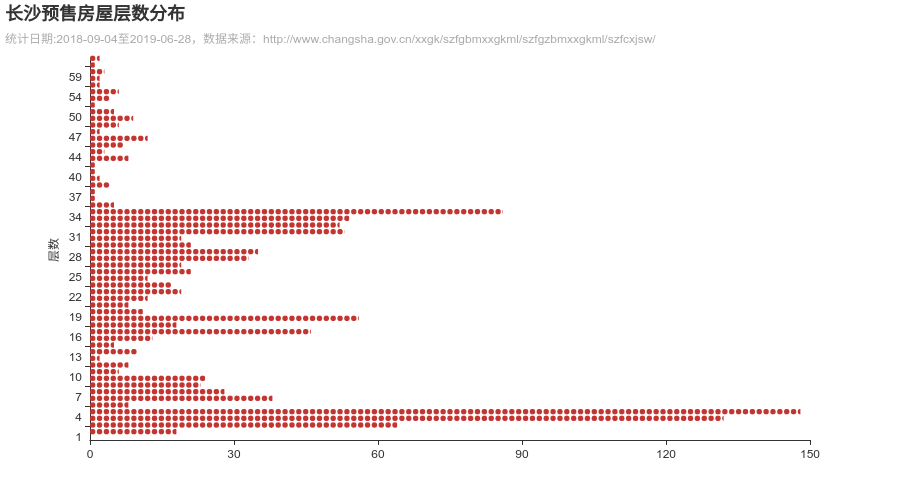
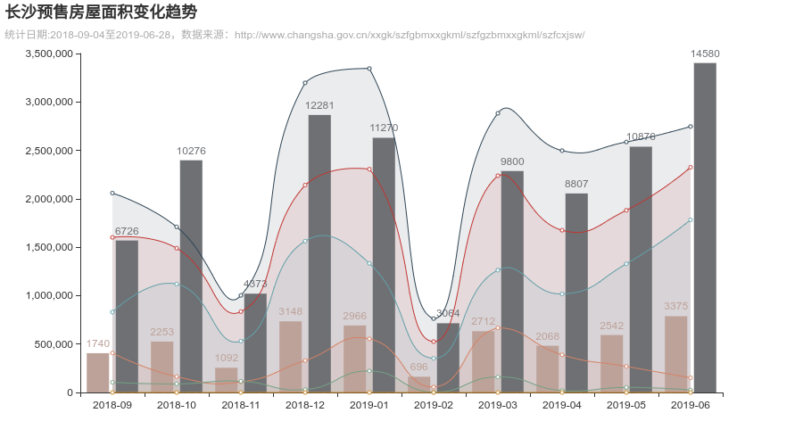
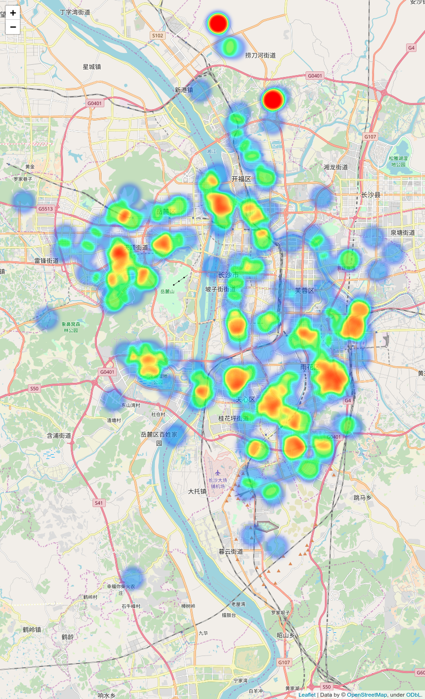

## 长沙房屋预售信息可视化


### 统计房屋层数
```
python 01_changsha_zhufangyushou.py stat_floors_distribution
```



### 统计房屋面积变化趋势
```
python 01_changsha_zhufangyushou.py stat_area_trend
```




### 房屋居住面积位置分布
```
python 01_changsha_zhufangyushou.py stat_geo
```

